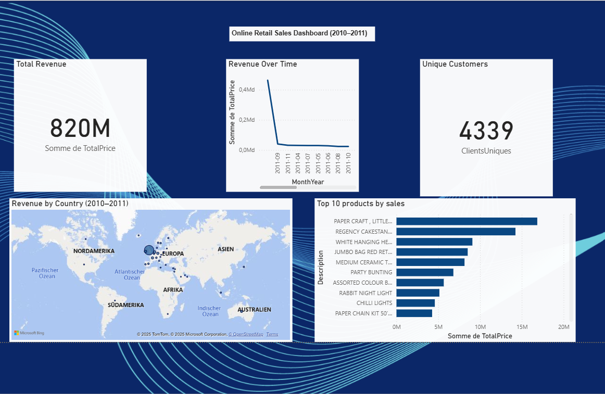

# 🛍️ Online Retail Sales Analysis

## 🎯 Business & Project Objectives

Analyze customer transactions to understand purchasing behavior, identify the most profitable products and customers, visualize sales trends, and provide actionable business recommendations.

From a business perspective, this type of analysis can help e-commerce stakeholders:
- Identify the **top-selling products** to prioritize inventory and marketing efforts
- Detect **underperforming markets** to reconsider international strategy
- Understand **customer lifetime value (CLV)** and **segment clients** for better targeting
- Optimize **sales periods and promotions** by analyzing time-based patterns

For example, identifying that 80% of revenue comes from 20% of products (Pareto principle) could lead to **inventory optimization and cost reduction**. Spotting peak purchasing hours/days allows better **ad budget allocation** and **staffing decisions**.

This project is part of my data portfolio demonstrating both **data analysis skills** and **the ability to generate data-driven business insights** using real-world e-commerce data.

---

## 📦 Dataset

- **Name:** Online Retail Dataset  
- **Source:** [UCI Repository / Kaggle](https://www.kaggle.com/datasets/carrie1/ecommerce-data)  
- **Period:** December 2010 – December 2011  
- **Size:** ~500,000 rows  
- **Events:** Invoices, products, prices, customers, countries

---

## 🧰 Tools & Technologies

- Python (pandas, numpy, matplotlib, seaborn)
- Jupyter Notebook
- Git & GitHub

---

## 📊 Analysis Highlights

- Data cleaning: removed canceled orders, handled missing customer IDs  
- Time-based features: extracted day, hour, month from `InvoiceDate`  
- KPIs calculated: total revenue, average basket size, top products  
- Visualizations: sales by hour/day, top countries, top customers

---

## 📈 Key Business Insights

- **Top Products:** "PAPER CRAFT , LITTLE BIRDIE", "REGENCY CAKESTAND 3 TIER"  
- **Sales Peaks:** 10AM–3PM shows highest transaction volume  
- **UK leads sales**, followed by Netherlands and Germany  
- **Revenue concentration:** few products and customers drive most revenue

---

## 💡 Recommendations

- Focus marketing efforts on high-performing products and customers  
- Promote top products in underperforming countries  
- Schedule promotions during peak sales hours  
- Develop customer loyalty programs for repeat buyers

---

## 📎 Project Files

- `notebooks/retail_analysis.ipynb`: full analysis in Jupyter Notebook  
- `dashboard/retail_dashboard.pbix`: interactive Power BI dashboard file  
- `images/powerbi_dashboard.png`: preview image of the dashboard  
- `data/`: original dataset  
- `README.md`: this file

---

## 📊 Power BI Dashboard 

To complement the Jupyter notebook analysis, I created an interactive dashboard using Power BI.

### Key Metrics Displayed:
- 💰 **Total Revenue**
- 📈 **Revenue Over Time**
- 👤 **Unique Customers**
- 🌍 **Revenue by Country**
- 🏆 **Top 10 Products by Sales**

📂 File available in the [`dashboard`](./dashboard/retail_dashboard.pbix) folder.  
🖼️ Preview:

---

*This dashboard provides a high-level, visual summary of the online retail performance and can be used by business teams for quick strategic decisions.*

📌 *This project is part of a data analytics portfolio focused on business understanding and storytelling.*
